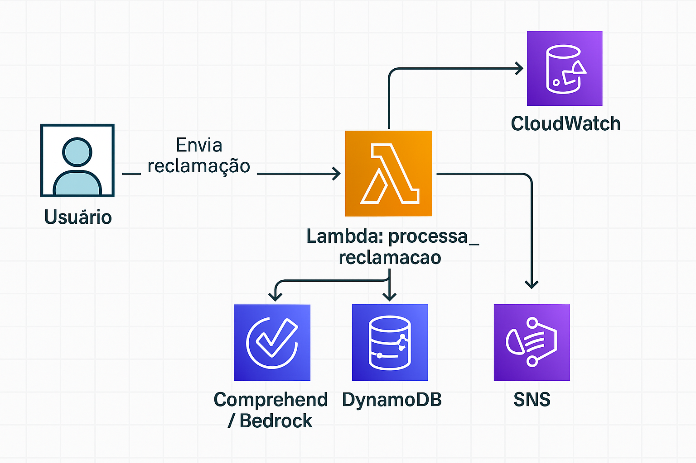
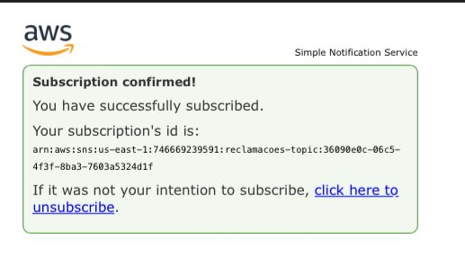
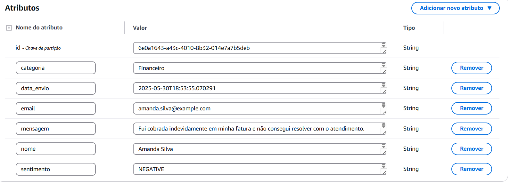
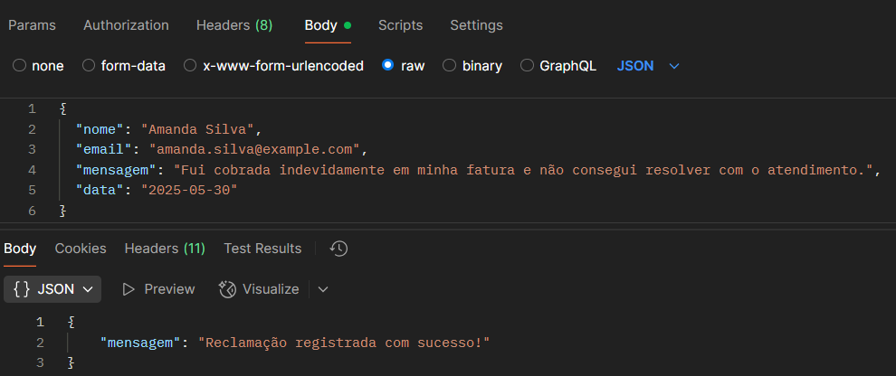

<div style="text-align: center;">
  
</div>


##   Análise de Reclamações com AWS e Terraform

Este repositório contém a infraestrutura como código (IaC) de um sistema serverless desenvolvido com **AWS** e **Terraform**, com o objetivo de processar ,classificar e analisar reclamações de forma automatizada.

##  Objetivo

O projeto visa automatizar o processamento de reclamações enviadas via API. Cada reclamação será analisada por uma função **AWS Lambda**, que poderá:

- Armazenar a reclamação em uma tabela do **DynamoDB**;
- Analisar sentimento usando **Amazon Comprehend** e **Bedrock**;
- Publicar alertas via **SNS** (em casos críticos ou ofensivos);
- Integrar com **Step Functions** para orquestrar o fluxo;
- Registrar logs com **CloudWatch Logs**;
- Ser acessado por meio de uma API REST com **API Gateway**.

Tudo isso será gerenciado com **Terraform**, garantindo reprodutibilidade, controle de versão e automação da infraestrutura.

##  Arquitetura Inicial
<div style="text-align: center;">
  
</div>


##  Estrutura do Projeto(em construção)

```
projeto-serverless/
├── lambda_src/
│   ├── handler.py
│   └── lambda.zip
|   ├── sentiment_analysis.py         
|   ├── classification_analysis.py    
|   ├── requirements.txt              
|   └── utils/                        
├── terraform/
│   ├── apigateway/
│   │   ├── apigateway.tf
│   │   ├── outputs.tf
│   │   └── variables.tf
│   ├── cloudwatch/
│   │   ├── alarms.tf
│   │   ├── dashboard.tf
│   │   ├── logs.tf
│   │   └── variables.tf
│   ├── dynamodb/
│   │   ├── dynamodb.tf
│   │   ├── outputs.tf
│   │   └── variables.tf
│   ├── iam/
│   │   ├── lambda_role.tf
│   │   ├── outputs.tf
│   │   ├── step_function_role.tf
│   │   └── variables.tf
│   ├── lambda/
│   │   ├── lambda.tf
│   │   ├── outputs.tf
│   │   └── variables.tf
│   ├── sns/
│   │   ├── outputs.tf
│   │   ├── subscription.tf
│   │   ├── topic.tf
│   │   └── variables.tf
│   ├── stepfunctions/
│   │   ├── state_machine.tf
│   │   └── variables.tf
│   ├── providers.tf
│   └── versions.tf
├── venv/
├── .gitignore
├── .terraform.lock.hcl
├── arquitetura.png
├── foto-campos.png
├── main.tf
├── outputs.tf
├── variables.tf
├── zip_lambda.sh
└── README.md
```
## Notificações com Amazon SNS

O projeto utiliza o **Amazon SNS (Simple Notification Service)** para enviar notificações por e-mail sempre que uma nova reclamação é registrada.

### Como funciona:

- Um tópico SNS é criado via Terraform.
- Um e-mail é inscrito como assinante desse tópico.
- Após uma reclamação ser registrada no DynamoDB, a Lambda publica uma mensagem no tópico SNS.
- O assinante (e-mail) recebe os detalhes da reclamação automaticamente.

> ⚠️ Atenção: é necessário **confirmar a assinatura do e-mail** clicando no link enviado pela AWS após o `terraform apply`.

#### Exemplo de notificação enviada 
```
{
  "id": "123e4567-e89b-12d3-a456-426614174000",
  "nome": "João Silva",
  "email": "joao@email.com",
  "mensagem": "Estou com problemas no serviço.",
  "data_envio": "2025-05-20T18:22:15.134Z"
}
```

<div style="text-align: center;">
  <br>
</div>

---

### 🧠 Análise de Sentimento com Amazon Comprehend
A função Lambda utiliza o **Amazon Comprehend** para identificar o sentimento da mensagem enviada pelo usuário.

- A função `detectar_sentimento` envia o texto para o Comprehend.
- Retornos possíveis:
  - `POSITIVE`
  - `NEGATIVE`
  - `NEUTRAL`
  - `MIXED`
  - `INDETERMINADO` (em caso de erro ou mensagem vazia)

O sentimento detectado é salvo junto com a reclamação no banco de dados.

---

###  Armazenamento no DynamoDB
As reclamações são armazenadas na tabela **`reclamacoes`** do **Amazon DynamoDB** com os seguintes campos:

- `id` (UUID gerado automaticamente)
- `nome` (nome do reclamante)
- `email` (email do reclamante)
- `mensagem` (texto da reclamação)
- `data_envio` (data/hora em formato ISO)
- `sentimento` (classificação feita via Amazon Comprehend)


<div style="text-align: center;">
  <br>
</div>

---

###  Testes Realizados
- A API foi testada com sucesso via **Postman**.
- Os dados foram enviados corretamente para a Lambda e armazenados no **DynamoDB**.
- Os itens estão disponíveis no console do DynamoDB, em:  
  `Tabelas > reclamacoes > Explore table items`
<div style="text-align: center;">
  <br>
</div>

---


##  Funcionalidades Já Implementadas

- [x] Estrutura modular com Terraform
- [x] Criação de role e política IAM para Lambda
- [x] Script de empacotamento da Lambda (`zip_lambda.sh`)
- [x] Backend remoto com **S3** e **DynamoDB** (state lock)
- [x] Step functions 
- [x] Integração com API Gateway 
- [x] Notificação com SNS
- [x] Criação da Lambda com lógica de análise de reclamação
- [X] Configuração do DynamoDB (tabela de reclamações)
- [x] Orquestração com Step Functions
- [x] Uso de modelos de IA com  Comprehend
---

---

##  Desenvolvedora

<div style="text-align: center;">
  <br>
  <strong>Amanda Ximenes</strong><br>
  Desenvolvedora Jr
</div>


📧 **Email:** amandacamposx2@gmail.com  
🔗 **LinkedIn:** [linkedin.com/in/amandaximenes](https://www.linkedin.com/in/amanda-ximenes-a02ab8266/)

---

> Projeto acadêmico com fins de aprendizado e portfólio. Infraestrutura provisionada com Terraform, código organizado em módulos e boas práticas de automação.


